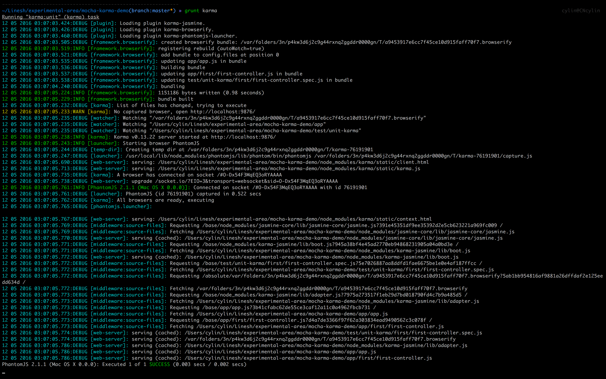
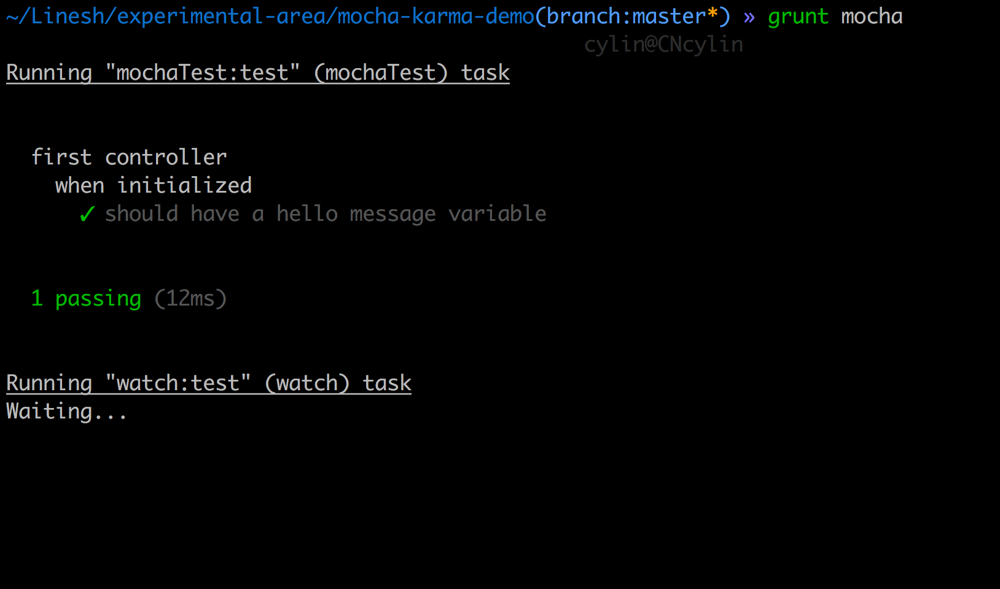

# README 读我

This repo is intended to demo the following things:

* What's the user interface of karma/mocha as a test runner
* What would writing unit test for Angular written in ES6 manner be like in Chai/Jasmine syntax
* What's the usage(advantage) of using karma/mocha? And what about for Chai/Jasmine?
* What will be the learning curve/cost for the team if we choose any of the tools?

目前项目上面临选用karma/jasmine还是mocha/chai/sinon做测试框架的选择，因此这个demo仓库是为了比较两者：

* karma/mocha作为test runner，各自用户界面如何
* 如何使用各自的断言库Chai/Jasmine对基于ES6编写的Angular代码进行测试
* karma/jasmine及mocha/chai/sinon各自套件的优劣（特点）是什么？适用于何种场景？
* 在项目已经setup好Karma以及当前的项目现状下，改用mocha/chai/sinon套件有何风险？学习成本？

## What tech-stack is used for demonstration purpose in this repo?

* Front-end framework
	* [x] Angular
* Front-end TESTING framework(runner&assertion library)
	* [x] mocha
	* [x] karma
	* [x] chai
	* [x] jasmine
* Front-end build tools
	* [x] npm(install dependencies)
	* [x] bower(will actually not be used in this demo)
	* [x] grunt(run build/copy/minify/watch/test tasks)
	* [x] babelify(to transpile ES6 code)
	* [x] browserify(as we're currently using in the project)

## How can I start this demo locally?

For starting the server, the easiest way to do is using npm's http-server module. Please make sure you have `http-server` installed globally in your machine by running:

```
npm install -g http-server
```

Make sure you have run `npm install` at least once after you pulled the code and then simply run:

```
npm install
http-server -p 3939
```

and visit `localhost:3939`

## How can I run tests using mocha/karma?

Try the following commands to run tests using mocha/karma in the project root after you checked in the code and have all the dependencies installed:

```
grunt mocha
grunt karma
```

## What's the user interface of mocha/karma?

When it comes to Karma, the console output gets overwhelmed by a lot of loading messages even though I've tried to minimize the font size. Of course there're ways for you to suppress karma's console output, but another thing revealed is that Karma's trying to loading something before running the tests. Please refer to the next section of how they works and what's the advantage of them.



Below's mocha one:



## How code writeen in Chai/Jasmine assertion look like?

In conclusion, Jasmine more intended to a all-in-one solution while Mocha acts only as a test runner and leave assertion and test doubles to other tools(for those tends to be the most popular, Chai is for assertion and Sinon for interacting with Sinon).

### API

Assertions for Jasmine/Chai are pretty much the same.g

### Mock

### Asynchronous Testing(Promise, api call)

## How mocha/karma works && What's the advantages of their own?

## Learning curves

## Concerns && Suggestions
* Risk of new tools(learning curve)
* Support of debug
* Community maturity
* ...
